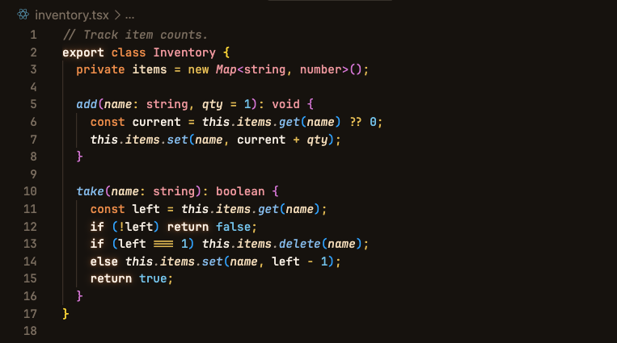
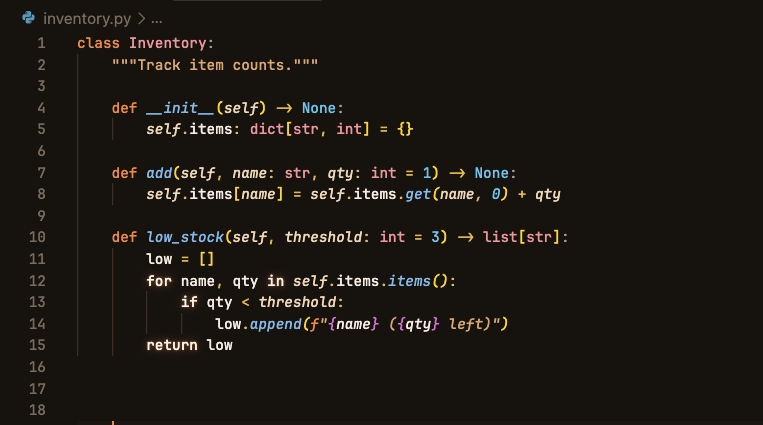
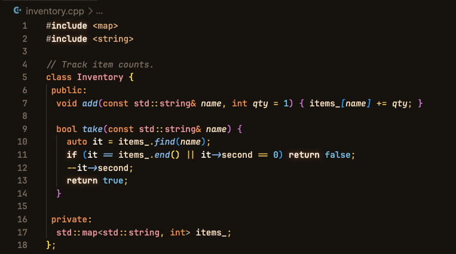
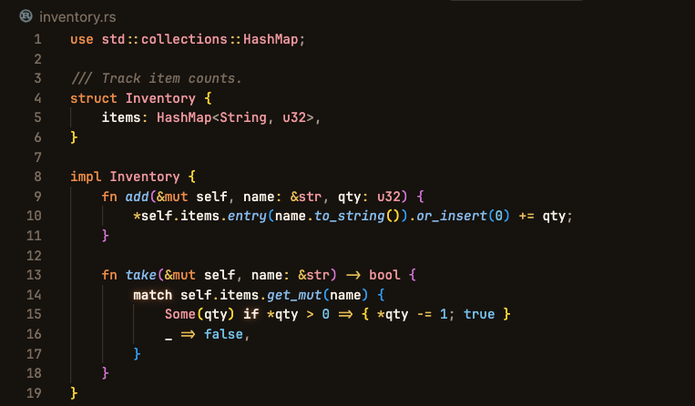
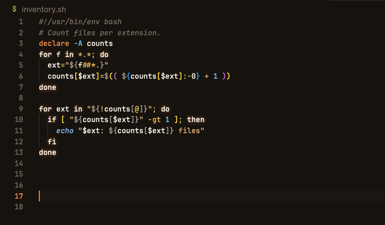

# Frizlo Warm Kitchen

A warm charcoal VS Code dark theme, taken from the Frizlo app palette.

Warm Kitchen is the palette from [Frizlo](https://frizlo.app), my kitchen
inventory app — the same warm charcoal ground, paprika accent, and the
appliance tints it uses for pantry, fridge, freezer and wine storage. The
app's expiry states (fresh, soon, urgent, expired) become the editor's
diagnostics, git gutter and terminal colours.


You can see the app at **[frizlo.app](https://frizlo.app)**.

## Screenshots

### TypeScript



### Python



### C++



### Rust



### Shell



Backgrounds are lifted slightly above the app's own values and real border
colours are derived: the apps ship `background` and `border` both as near-black,
which works on a phone but would make panel edges, hover and selection
invisible in an editor.

## Install

Download the prebuilt `.vsix` from the [latest release](https://github.com/NLykoskoufis/frizlo-warm-kitchen-theme/releases/latest), then either:

- VS Code → Extensions panel → `⋯` menu → **Install from VSIX…**, or
- `code --install-extension <downloaded-file>.vsix`

### From source

Requires Node.js. From the repo root:

```bash
npx @vscode/vsce package --allow-missing-repository --skip-license --out /tmp/frizlo-warm-kitchen-theme.vsix
code --install-extension /tmp/frizlo-warm-kitchen-theme.vsix
```

Reload the window, then pick **Frizlo Warm Kitchen** via `Cmd+K Cmd+T` (macOS) or `Ctrl+K Ctrl+T` (Windows/Linux).

Copying the folder into `~/.vscode/extensions/` does not work — VS Code only
loads extensions listed in `extensions.json`, which the installer writes.

## Licence

MIT — see [`LICENSE`](LICENSE).
